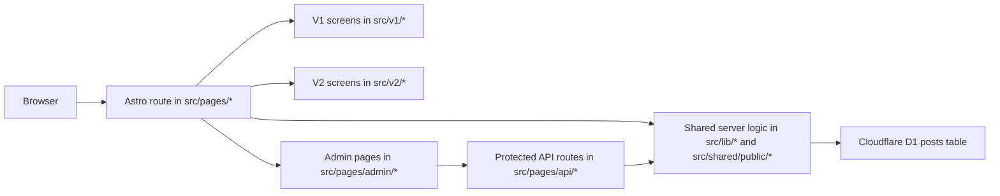

# 1. Title: Deepanker Personal Website Architecture Source of Truth

This document is the single source of truth for how the current system works as implemented in this repository.

Evidence policy used throughout:

- Confirmed: directly visible in the current codebase, config, schema, or scripts inspected on 2026-03-25.
- Reasonable inference: not stated explicitly, but strongly implied by the implementation.
- Unclear: not verifiable from this repository alone.

## 2. Executive Summary

This project is an Astro server-rendered personal writing platform deployed to Cloudflare Workers and backed by Cloudflare D1. Its product purpose is simple: publish essays and long-form writing with a lightweight built-in admin CMS, while serving two different public reading experiences from the same content store.

Confirmed architecture shape:

- One content source of truth: the `posts` table in D1.
- One shared server/data layer: `src/lib/*` and `src/shared/public/*`.
- Three runtime-facing surfaces:
  - canonical public V1 at `/` and `/writing/*`
  - preview public V2 at `/v2/*`
  - protected admin/CMS at `/admin/*` plus `/api/*`
- Thin route wrappers under `src/pages/*` that fetch data and hand it to screen components.
- Version-specific presentation layers isolated under `src/v1/*` and `src/v2/*`.
- A legacy top-level presentation layer under `src/components/*`, `src/layouts/*`, and `src/styles/*` that still matters for admin and preview flows.

The most important architectural decision is that the product has one shared editorial model and two public presentations. V1 and V2 do not own separate content or separate APIs. They are two rendering systems over the same published D1 rows.

Another key decision is that rendering happens in two stages:

- write time: markdown is converted to `rendered_html` and stored in D1
- read time: Astro fetches rows from D1 and injects the stored HTML into V1 or V2 layouts

This means the system is not a static Markdown-file blog, not an Astro content-collections site, and not a React app. It is a server-rendered Astro site with small inline JavaScript enhancements layered onto HTML pages.

Confirmed implementation choices that came directly from the V2 plan and still define the current system:

- the split happens at the public presentation layer, not the CMS/data-entry layer
- V1 remains canonical on the original routes
- V2 is a namespaced preview under `/v2`, not a subdomain and not a same-route toggle
- there is one shared CMS/admin flow, not a dual CMS and not dual authoring systems
- the only additive V2 MVP content-model change is optional cover metadata
- the implementation favors small, direct, non-platform-building code over a heavier abstraction stack

## 3. Product Overview

### What the project is

Confirmed: this is a personal writing website for essays, reflections, and long-form writing by Deepanker Seth. The public product includes:

- a classic canonical site
- a newer V2 "Quiet Observatory" preview experience
- an RSS feed
- an internal admin interface for writing, editing, previewing, publishing, and deleting posts

### Who it serves

Confirmed:

- readers who browse and read essays on the public site
- the site owner, who uses the built-in admin panel as the content author

Reasonable inference: there is only one intended author/operator at the moment. The auth model is a single password and a single admin token, not a multi-user account system.

### User-facing experiences

Confirmed:

- V1 home: `/`
- V1 writing index: `/writing`
- V1 post detail: `/writing/:slug`
- V2 home: `/v2`
- V2 library: `/v2/writing`
- V2 essay detail: `/v2/writing/:slug`
- RSS: `/rss.xml`
- Admin login: `/admin/login`
- Admin dashboard/editor/preview: `/admin/*`

### How V1 and V2 relate

Confirmed:

- V1 is the canonical public experience.
- V2 is a preview experience called Quiet Observatory.
- V2 pages intentionally emit `noindex,follow` and canonicalize back to the matching V1 route.
- V1 and V2 read the same published D1 posts.
- V2 adds richer presentation, discovery, and reading controls without changing the underlying content model.

### What the admin workflow is

Confirmed:

- the author logs in with a password
- the author creates or edits a post in the browser
- the server stores both raw markdown and rendered HTML in D1
- publishing a post makes it visible to both V1 and V2 public routes

## 4. System Architecture Overview

At macro level, the system is a server-rendered Astro app with Cloudflare-specific runtime bindings and a shared content database.

### Major subsystems

Confirmed:

- Runtime/config subsystem
  - `astro.config.mjs`
  - `wrangler.json`
  - `src/env.d.ts`

- Data/content subsystem
  - `schema.sql`
  - `migrations/*`
  - `src/lib/db.ts`
  - `src/lib/markdown.ts`

- Auth and route protection subsystem
  - `src/lib/auth.ts`
  - `src/middleware.ts`
  - `src/pages/api/auth/*`

- Canonical public V1 subsystem
  - thin route files in `src/pages/*`
  - V1 screens, layouts, components, and styles in `src/v1/*`

- Preview public V2 subsystem
  - route files in `src/pages/v2/*`
  - V2 screens, layouts, features, components, and styles in `src/v2/*`

- Admin/CMS subsystem
  - admin pages in `src/pages/admin/*`
  - CRUD APIs in `src/pages/api/posts/*`
  - legacy top-level layout/component/style files used by admin and preview

- Shared public contract subsystem
  - `src/shared/public/routes.ts`
  - `src/shared/public/covers.ts`

- Verification/guardrail subsystem
  - `scripts/check-version-boundaries.mjs`
  - `scripts/route-smoke.mjs`
  - `scripts/final-qa-audit.mjs`

### High-level request and rendering flow

Confirmed:

1. A request hits an Astro route in `src/pages/*`.
2. The route reads Cloudflare bindings from `Astro.locals.runtime.env`.
3. The route fetches data through `src/lib/db.ts`.
4. The route passes plain data objects into a V1 screen, V2 screen, admin page, or API response.
5. Astro renders HTML on the server.
6. Optional inline JavaScript enhances the page after load for things like theme toggles, search/filter UI, reading controls, and admin form actions.

### How rendering differs between V1 and V2

Confirmed:

- V1 is a simpler typography-first presentation.
- V2 is a more stylized editorial preview with generated covers, immersive layout, richer archive controls, and reader preferences.
- Both render server-fetched published posts.
- Both use the same `Post` data contract from `src/lib/db.ts`.

### Important architectural truth

Confirmed: V1 and V2 are presentation layers, not separate applications with separate backends.

The practical layering is:

1. D1 row shape
2. shared server helpers
3. route wrappers
4. version-specific presentation
5. inline client enhancement scripts

## 5. Codebase Structure

This section explains the repository by responsibility rather than just listing folders.

### Root-level infrastructure and content files

- `package.json`
  - scripts, dependencies, Node requirement, deploy/check/smoke/audit entry points

- `astro.config.mjs`
  - Astro SSR config, site URL, Cloudflare adapter, MDX and sitemap integrations

- `wrangler.json`
  - Cloudflare Worker runtime config, D1 binding, asset binding, Worker entrypoint

- `schema.sql`
  - canonical D1 schema for the `posts` table

- `migrations/`
  - additive schema follow-ups for already-created D1 databases

- `seed.sql`
  - local sample content

### `src/pages/`: runtime entry points

This is the real request surface of the app.

- `src/pages/index.astro`, `src/pages/writing/*`
  - canonical public V1 route wrappers

- `src/pages/v2/*`
  - V2 preview route wrappers

- `src/pages/admin/*`
  - admin UI routes

- `src/pages/api/*`
  - login/logout and post CRUD endpoints

- `src/pages/rss.xml.js`
  - RSS feed generation

### `src/lib/`: shared server logic

This is the core backend logic used across public and admin surfaces.

- `db.ts`
  - shared post model and all database access helpers

- `auth.ts`
  - password hashing, token creation/verification, cookie helpers

- `markdown.ts`
  - markdown-to-HTML rendering, reading-time estimation, slug generation

### `src/shared/public/`: cross-version public contracts

This folder is where shared public rules are supposed to live instead of leaking directly between `src/v1/*` and `src/v2/*`.

- `routes.ts`
  - public route naming contract

- `covers.ts`
  - allowed V2 cover metadata values and normalization logic

### Current deviations from the original V2 plan structure

The current repo is close to the implementation plan, but not identical to the illustrative folder sketch in that plan.

Confirmed deviations:

- the plan sketched `src/shared/public/seo.ts`; the implementation does not have a shared SEO helper file
  - actual SEO behavior lives in the head components
  - V1 canonical head logic is in `src/v1/components/BaseHead.astro`
  - V2 preview canonical/noindex logic is in `src/v2/components/chrome/BaseHead.astro`

- the plan sketched `src/shared/public/cover.ts`
  - actual shared metadata contract lives in `src/shared/public/covers.ts`
  - actual V2 cover-generation engine lives in `src/v2/features/covers/cover.ts`

- the plan sketched a V1 `EssayScreen.astro`
  - actual V1 detail screen is `src/v1/screens/WritingPostScreen.astro`

- the plan said new public work should stop accumulating in the legacy top-level public layer
  - public V1/V2 work follows that rule
  - however, the top-level legacy layout/component/style layer still remains runtime-relevant for admin and preview flows

### `src/v1/`: canonical classic public presentation layer

Confirmed: this is the extracted canonical classic site.

- `screens/`
  - route-level V1 screens

- `layouts/`
  - V1 page shells

- `components/`
  - V1 public UI components

- `styles/`
  - V1 global stylesheet

### `src/v2/`: Quiet Observatory preview presentation layer

Confirmed: this is the newer preview experience.

- `screens/`
  - route-level V2 screens

- `layouts/`
  - V2 page shell

- `components/chrome/`
  - V2 head/header/footer/navigation chrome, including the compact two-row mobile header contract

- `features/covers/`
  - deterministic cover-generation logic, shared cover component, and responsive cover sizing ownership

- `features/discovery/`
  - archive/library controls and mobile-density tuning for discovery surfaces

- `features/reading/`
  - essay reading controls, progress UI, and the desktop-sidebar/mobile-inline reading-control split

- `styles/`
  - V2 tokens, globals, motion system, shared mobile sizing, and prose containment rules

### Legacy top-level presentation files

Confirmed:

- `src/components/*`
- `src/layouts/*`
- `src/styles/global.css`

These are not the canonical V1 public layer anymore, but they are still runtime-relevant.

Confirmed current usage:

- `src/layouts/AdminLayout.astro` uses top-level `src/components/BaseHead.astro`
- `src/pages/admin/login.astro` uses top-level `src/components/BaseHead.astro`
- `src/pages/admin/posts/[id]/preview.astro` uses top-level `src/layouts/PostLayout.astro`

Reasonable inference: these top-level files are effectively legacy/classic carry-over modules that now primarily support admin and preview surfaces.

### `docs/v2/`: implementation notes, not system source of truth

Confirmed: these docs cover V2 extraction, contracts, release checks, and migration notes. They are useful supplements, but they do not explain the entire system end to end.

### `scripts/`: architectural guardrails and QA

- `check-version-boundaries.mjs`
  - enforces no direct imports between `src/v1/*` and `src/v2/*`

- `route-smoke.mjs`
  - verifies core routes render and contain expected content

- `final-qa-audit.mjs`
  - verifies V2 structure/accessibility markers and client asset budgets

## 6. Frontend Architecture

### Routing model

Confirmed:

- Astro file-based routing is the only page routing system.
- Public V1 routes live directly under `src/pages/`.
- V2 routes live under `src/pages/v2/`.
- Admin routes live under `src/pages/admin/`.
- API routes live under `src/pages/api/`.

The route files themselves are intentionally thin. They mostly do three things:

1. fetch shared data
2. handle simple 404/redirect logic
3. hand the result to a screen component

That means the repo uses a page-wrapper pattern:

- route file = data entry point
- screen file = presentation entry point

### Rendering strategy

Confirmed:

- Astro is configured with `output: "server"`.
- Public and admin pages are server-rendered HTML.
- Client interactivity is implemented with inline `<script>` blocks inside Astro components and pages.
- There is no React, Vue, or other client framework in the implementation.
- There is no extra page-framework layer above Astro components.
- There is no same-route public feature flagging between V1 and V2.
- There is no subdomain split between V1 and V2.

Reasonable inference: the design goal is to keep public pages extremely light while still allowing focused DOM enhancements.

### Client-side behavior pattern

Confirmed:

- Interactivity is mostly progressive enhancement over server-rendered markup.
- Scripts bind by DOM IDs, classes, and `data-*` attributes.
- Many scripts are rebound on `astro:page-load` to support Astro client navigation semantics.

Examples:

- V1 home greeting rotation
- V1 writing search and tag filtering
- V1 and V2 theme toggles
- V2 archive search/filter/sort state syncing with `URLSearchParams`
- V2 reading tone/measure/type settings via `localStorage`
- admin login form submission
- admin save/delete actions

### V1 frontend

Confirmed layout:

- `src/pages/index.astro` -> `src/v1/screens/HomeScreen.astro`
- `src/pages/writing/index.astro` -> `src/v1/screens/WritingIndexScreen.astro`
- `src/pages/writing/[slug].astro` -> `src/v1/screens/WritingPostScreen.astro`

Confirmed characteristics:

- typography-first classic layout
- sticky header, footer, theme toggle
- essay list cards with date, read time, description, and tags
- client-side search and tag filters on the writing index
- article pages render stored HTML into a prose container

Confirmed V1 page composition:

- `BaseLayout.astro`
  - page shell for home and index

- `PostLayout.astro`
  - article shell with date, read time, tags, and last updated info

- `PostCard.astro`
  - reusable list card

- `SearchBar.astro` and `TagFilter.astro`
  - client-side DOM filtering utilities

### V1 styling approach

Confirmed:

- V1 styling is self-contained in `src/v1/styles/global.css`
- classic typography uses Inter plus Source Serif 4
- theme is controlled through `html[data-theme="dark"]`

### V2 frontend

Confirmed layout:

- `src/pages/v2/index.astro` -> `src/v2/screens/HomeScreen.astro`
- `src/pages/v2/writing/index.astro` -> `src/v2/screens/WritingIndexScreen.astro`
- `src/pages/v2/writing/[slug].astro` -> `src/v2/screens/EssayScreen.astro`

Confirmed characteristics:

- V2 is a visually richer editorial presentation
- V2 layout adds a decorative background layer, sticky glass navigation, and a more designed footer
- V2 generates visual covers procedurally from post metadata
- V2 library natively supports real-time text search without complex filtering
- V2 essay pages add reading progress and reading-mode controls

Confirmed V2 page composition:

- `BaseLayout.astro`
  - V2 shell, header/footer, background, reveal script, default noindex behavior, and shared mobile shell spacing

- `HomeScreen.astro`
  - hero with animated greeting, lead essay, a single unified featured shelf, and mobile-specific lead-artifact compression

- `WritingIndexScreen.astro`
  - library intro, search controls, result count, filtered card list, and compact mobile archive density

- `EssayScreen.astro`
  - masthead cover, article content, related posts, desktop sticky reading sidebar, and mobile in-flow reading controls

- `PostArtifactCard.astro`
  - reusable V2 artifact card used by home, library, and related-post sections, including shared compact-card mobile row behavior

- `V2Cover.astro` + `cover.ts`
  - deterministic procedural cover system, with `V2Cover.astro` owning feature/masthead/stamp min-height behavior across breakpoints

- `ArchiveControls.astro`
  - search UI with compact mobile spacing

- `ReadingControls.astro`
  - progress bar, tone/measure/type controls, link back to classic, and compact mobile variant

### V2 styling approach

Confirmed:

- `src/v2/styles/tokens.css` defines a separate V2 token system
- `src/v2/styles/global.css` defines V2 resets, layout utilities, prose rules, inputs, tags, panels, and shared small-screen sizing/containment rules
- `src/v2/styles/motion.css` defines reveal/lift/ambient motion behaviors
- V2 typography uses Instrument Serif, Newsreader, Instrument Sans, and IBM Plex Mono

Implementation note relative to the plan:

- the plan described conceptual token groups like `chalk`, `fog`, `basalt`, and `ink`
- the actual implementation uses more conventional CSS custom property names such as `--color-bg`, `--color-surface`, `--color-text`, and `--color-accent`
- the architectural intent is the same, but the literal token names differ from the plan sketch

### Desktop/mobile behavior

Confirmed:

- both V1 and V2 have responsive CSS
- V2 header keeps a single-row glass nav on larger widths, compresses at `780px`, and becomes an explicit two-row layout at `720px` with brand plus theme toggle on the first row and nav pills on the second
- V2 home keeps the same section structure on mobile, but the lead essay swaps from the larger feature cover to a smaller compact card-style cover under the main mobile breakpoint
- V2 archive controls collapse to a single-column control stack on smaller screens, while compact artifact cards stay in a narrow row layout instead of collapsing into a loose single-column card
- V2 essay reading controls stay as a sticky sidebar above `1024px` and switch to a compact in-flow panel below that breakpoint; there is no fixed bottom dock in the current implementation
- shared V2 mobile rules also reduce pill/input sizing, tighten shell spacing, and add protective prose containment below the main mobile breakpoint
- V1 list/detail shells reduce spacing and heading sizes on mobile

### Important frontend implementation detail

Confirmed: V2 uses DOM data attributes as a micro-level communication contract between server-rendered markup and inline scripts.

Examples:

- `[data-post-card]`, `data-title`, `data-tags`, `data-reading-time` on V2 cards
- `#library-controls`, `#library-list`, `#library-count` for archive discovery
- `[data-reading-controls]`, `[data-reading-progress-track]`, `[data-reading-progress-bar]` for essay controls
- `[data-reveal]` for reveal animation

That means changes to IDs and `data-*` attributes can break behavior even if the UI still looks correct.

### V2 MVP constraints that are part of the current architecture

Confirmed:

- the V2 homepage is built from fixed sections in code, not CMS-managed homepage modules
  - the inquiry-strip copy is currently hard-coded inside `src/v2/screens/HomeScreen.astro`

- the V2 archive is SSR-first and then enhanced client-side
  - search filtering and query persistence happen in browser code after the server renders the list

- the cover system is generated SVG/CSS only
  - there is no uploaded cover-asset flow and no media pipeline

- reading preferences are stored locally in `localStorage`
  - there is no server persistence for reading settings
  - the essay experience reuses one reading-controls component in full and compact form rather than introducing multiple independent control systems

- search/discovery stays client-side for MVP
  - there is no search backend, no Algolia, and no server-side full-text search layer

- motion is CSS-first with small JavaScript helpers
  - there is no GSAP, Framer Motion, or other heavy motion library in the implementation

## 7. Backend / API Architecture

### Runtime entry and environment access

Confirmed:

- Astro routes and middleware use Cloudflare runtime bindings from `Astro.locals.runtime.env` or `context.locals.runtime.env`.
- Environment contract is declared in `src/env.d.ts`:
  - `DB`
  - `ADMIN_PASSWORD_HASH`
  - `JWT_SECRET`

### Middleware and protection model

Confirmed behavior of `src/middleware.ts`:

- `/admin/login` is public
- `/api/auth/*` is public
- `/admin/*` is protected
- `/api/posts*` is protected

When unauthorized:

- admin requests redirect to `/admin/login`
- protected API requests return `401` JSON

### Authentication architecture

Confirmed:

- the system uses a single password, not named user accounts
- password verification is SHA-256 based via Web Crypto in `src/lib/auth.ts`
- auth token is a custom HMAC-SHA256 JWT-like token
- cookie name is `admin_token`
- cookie properties are `Path=/; HttpOnly; SameSite=Strict; Max-Age=7 days`

Reasonable inference: the simplicity is intentional for a single-author site, but it trades away multi-user features, rotation workflows, and richer auditability.

### API surface

Confirmed endpoints:

- `POST /api/auth/login`
  - checks password against `ADMIN_PASSWORD_HASH`
  - signs token with `JWT_SECRET`
  - sets the auth cookie

- `POST /api/auth/logout`
  - clears the auth cookie

- `GET /api/posts`
  - returns all posts, including drafts
  - intended for admin use

- `POST /api/posts`
  - validates title/content
  - generates slug if omitted
  - renders markdown to HTML
  - normalizes tags and optional cover metadata
  - creates a new row

- `GET /api/posts/:id`
  - returns one post by id for admin flows

- `PUT /api/posts/:id`
  - selectively updates fields
  - re-renders markdown if `content` changes
  - normalizes tags and cover metadata

- `DELETE /api/posts/:id`
  - deletes a row

### Business logic boundaries

Confirmed:

- persistent data logic is centralized in `src/lib/db.ts`
- markdown transformation is centralized in `src/lib/markdown.ts`
- cover metadata validation is centralized in `src/shared/public/covers.ts`
- route handlers mostly orchestrate inputs and outputs

This is a small, direct architecture. There is no separate domain-service layer beyond those shared helpers.

## 8. Data / Content Architecture

### Source of truth

Confirmed: the source of truth for content is the D1 `posts` table.

Also confirmed: `src/content.config.ts` explicitly says Astro content collections are no longer used and posts now live in D1.

### Schema shape

Confirmed fields in `schema.sql` and `src/lib/db.ts`:

| Field | Type/shape | Purpose |
| --- | --- | --- |
| `id` | text UUID | primary key |
| `slug` | unique text | public route identity |
| `title` | text | display title |
| `description` | text | SEO and preview summary |
| `content` | text | raw markdown source |
| `rendered_html` | text | server-rendered HTML snapshot |
| `tags` | JSON array string | taxonomy for filtering and relatedness |
| `status` | `draft` or `published` | visibility control |
| `featured` | integer `0/1` | homepage/curation flag |
| `cover_variant` | nullable text | optional V2 cover override |
| `cover_accent` | nullable text | optional V2 cover override |
| `created_at` | ISO datetime string | creation timestamp |
| `updated_at` | ISO datetime string | update timestamp |
| `published_at` | nullable ISO datetime string | first publish timestamp |

### Important data model decisions

Confirmed:

- the DB stores both raw markdown and rendered HTML
- tags are stored denormalized as a JSON string, not a join table
- published posts are filtered at query time with `status = 'published'`
- `published_at` is set when a draft becomes published for the first time
- cover metadata is optional and additive
- `cover_variant` and `cover_accent` are the only V2-specific content-model additions in the current MVP

Confirmed absent/deferred fields from the implementation plan:

- no series/trails metadata
- no audio/TTS metadata
- no custom dek field
- no richer editorial metadata beyond the two cover overrides

### Write-time transformation pipeline

Confirmed:

1. Author submits title, markdown content, and optional metadata.
2. API validates inputs.
3. Slug is generated if not provided.
4. `renderMarkdown(content)` converts markdown to HTML.
5. Tags are normalized into an array and serialized to JSON.
6. Cover metadata is normalized against allowed values.
7. The row is inserted or updated in D1.

### Read-time transformation pipeline

Confirmed:

1. Public route queries fetch already-rendered rows.
2. V1 or V2 screen receives the full `Post`.
3. `rendered_html` is injected into the page.
4. Read time is recomputed from raw `content`.
5. Tags are parsed from JSON.
6. V2 cover is derived deterministically from slug/title/tags plus optional overrides.

### How V1 and V2 consume data

Confirmed:

- both V1 and V2 call the same D1 helper functions
- both operate on the same `Post` interface
- public routes only expose published posts
- admin routes/pages can access drafts and individual posts by id

### RSS flow

Confirmed:

- `src/pages/rss.xml.js` loads all published posts from D1
- RSS item links point to canonical V1 post URLs
- there is no separate V2-specific RSS or feed variant in the current architecture

## 9. Admin / Authoring Workflow

### Login flow

Confirmed:

1. Author opens `/admin/login`.
2. The page posts a password to `/api/auth/login`.
3. The server verifies the password and sets `admin_token`.
4. Middleware then permits future `/admin/*` and `/api/posts*` access.

### Dashboard flow

Confirmed:

1. `/admin` loads all posts via `getAllPosts(db)`.
2. The page renders a table of titles, statuses, update dates, and actions.
3. Delete actions call `DELETE /api/posts/:id` from the browser.

### New post flow

Confirmed:

1. `/admin/posts/new` renders a form with:
  - title
  - slug
  - tags
  - description
  - cover variant
  - cover accent
  - markdown content
  - featured flag
2. Save as Draft and Publish buttons both call `POST /api/posts`.
3. On success, the UI redirects to the edit page for the created post.

### Edit flow

Confirmed:

1. `/admin/posts/:id/edit` server-loads the post by id.
2. The page pre-fills all editable fields.
3. Save/Publish/Unpublish actions call `PUT /api/posts/:id`.
4. Delete calls `DELETE /api/posts/:id`.
5. The standalone Preview link goes to `/admin/posts/:id/preview`.

### Preview flow

There are two different preview mechanisms, and they are not the same.

Confirmed:

- Edit page "Preview" tab
  - uses a naive client-side regex-based markdown transformation
  - does not use the server markdown renderer

- New page "Preview" tab
  - currently performs `POST /api/posts` with a fake title of `"preview"` and draft status
  - then ignores the API response and renders a naive regex-based preview in the browser

- Standalone preview page `/admin/posts/:id/preview`
  - renders the saved `rendered_html` for an already-existing post
  - uses the legacy top-level `src/layouts/PostLayout.astro`

Important confirmed implication: the new-post preview tab can create real draft rows in D1 just by previewing. That is a behavioral risk, not just a cosmetic quirk.

### What stays shared between V1 and V2

Confirmed:

- title
- slug
- description
- content
- rendered HTML
- tags
- publish state
- featured flag
- optional V2 cover metadata

### What the shared CMS intentionally does not do

Confirmed:

- there is no separate V2-specific CMS workflow
- there is no admin redesign specifically for V2
- there is no dedicated V2 preview-authoring pipeline beyond the shared post editor and the public `/v2/*` routes
- there is no cover upload UI
- there are no V2-only fields for series, trails, audio, or richer editorial framing

### What happens after a post is added

Confirmed:

- if saved as draft, it stays visible only in admin flows
- if published, it becomes visible to:
  - V1 home and/or writing index depending on featured status
  - V2 home and/or library
  - V1 and V2 post detail routes
  - RSS feed

## 10. V1 / V2 Coexistence Model

### What V1 is

Confirmed: V1 is the canonical classic public experience. It owns the canonical public routes and canonical SEO targets.

### What V2 is

Confirmed: V2 is the Quiet Observatory preview experience. It is a separate presentation system under `/v2`, not a separate content backend.

### How they coexist

Confirmed:

- same D1 content
- same shared `Post` model
- same public route concepts: home, writing index, post detail
- separate screen/layout/component/style folders
- explicit import-boundary enforcement

### How users move between them

Confirmed:

- V1 footer links to V2 home via "Preview V2"
- V2 header links back to classic
- V2 reading controls include "Read in classic"
- V2 footer links back to classic and to the V2 library

### What is isolated

Confirmed:

- `src/v1/*` should contain V1-only presentation logic
- `src/v2/*` should contain V2-only presentation logic
- `scripts/check-version-boundaries.mjs` prevents direct imports from one version root into the other

### What is shared

Confirmed shared layers:

- `src/lib/db.ts`
- `src/lib/markdown.ts`
- `src/shared/public/routes.ts`
- `src/shared/public/covers.ts`
- site constants in `src/consts.ts`
- D1 schema and content rows

### What is not fully separated

Confirmed:

- admin uses top-level legacy components/styles, not `src/v1/*` or `src/v2/*`
- standalone admin preview uses top-level legacy `PostLayout`
- some legacy V1-style paths are still hard-coded directly instead of always going through `publicUrl`

Example confirmed from code:

- `src/v1/components/PostCard.astro` links directly to `/writing/${slug}/`
- `publicUrl()` is used heavily for V2 and some cross-version links, but not for every V1 internal link

### What should not be touched casually

Confirmed high-sensitivity areas:

- `src/lib/db.ts`
- `schema.sql` and migrations
- `src/lib/auth.ts`
- `src/middleware.ts`
- `src/shared/public/routes.ts`
- `src/shared/public/covers.ts`
- the import-boundary assumptions around `src/v1/*` and `src/v2/*`
- the top-level legacy files still used by admin and preview

### What is relatively safe to extend

Reasonable inference:

- V2 feature work inside `src/v2/*`, if it depends only on shared contracts
- V1 presentation refinements inside `src/v1/*`
- admin UI changes inside `src/pages/admin/*` and `src/layouts/AdminLayout.astro`

Any change that modifies content shape or shared routing is not local. It must be treated as a cross-system change.

## 11. End-to-End Flows

### Flow: user opens the homepage

1. Request hits `src/pages/index.astro`.
2. The route reads `DB` from `Astro.locals.runtime.env`.
3. It calls `getFeaturedPosts(db)` and `getAllPublishedPosts(db)`.
4. It passes both arrays to `src/v1/screens/HomeScreen.astro`.
5. V1 layout, header, and footer render the page.
6. Small inline JS rotates the greeting text and supports theme toggling.

### Flow: user reads an essay in V1

1. Request hits `src/pages/writing/[slug].astro`.
2. The route calls `getPostBySlug(db, slug)`, which only returns published rows.
3. The route passes the `Post` to `src/v1/screens/WritingPostScreen.astro`.
4. `src/v1/layouts/PostLayout.astro` computes tag list and reading time from the stored row.
5. The page injects `post.rendered_html` into the prose area.

### Flow: user reads an essay in V2

1. Request hits `src/pages/v2/writing/[slug].astro`.
2. The route loads the published post and all other published posts.
3. It passes both to `src/v2/screens/EssayScreen.astro`.
4. The screen computes:
  - parsed tags
  - read time
  - published/updated labels
  - related-post ranking by tag overlap and featured status
5. `V2Cover.astro` derives a procedural cover from the post data.
6. The page injects `post.rendered_html` into `.v2-prose`.
7. Inline JS initializes reading mode state and reading progress tracking.
8. SEO metadata marks the page as `noindex,follow` and canonicalizes to the V1 route.

### Flow: user switches between experiences

1. The user clicks a cross-version link.
2. The destination route fetches the same underlying D1 content.
3. Only the presentation layer changes.
4. In V2, canonical SEO still points back to V1.

### Flow: admin uploads a new writing

1. Admin signs in and opens `/admin/posts/new`.
2. The admin fills in title, markdown content, and optional metadata.
3. The browser sends a JSON payload to `POST /api/posts`.
4. The API:
  - validates input
  - generates slug if needed
  - renders markdown to HTML
  - normalizes tags
  - normalizes cover metadata
  - inserts the row into D1
5. The UI redirects to `/admin/posts/:id/edit`.

### Flow: a draft becomes visible on the live site

1. Admin saves or updates a post with `status: "published"`.
2. `PUT /api/posts/:id` or `POST /api/posts` writes the status.
3. If the row had no `published_at`, `src/lib/db.ts` sets it.
4. Public queries now include the row because they filter on `status = 'published'`.
5. The post appears on:
  - `/writing`
  - `/writing/:slug`
  - `/v2/writing`
  - `/v2/writing/:slug`
  - `/rss.xml`
  - home shelves if featured or recent enough

## 12. Key File / Module Responsibilities

This section focuses on the files that carry the architecture, not every trivial file.

### Runtime and configuration

| File | What it does | Depends on | Used by / Why it matters |
| --- | --- | --- | --- |
| `astro.config.mjs` | Configures Astro for SSR on Cloudflare, sets canonical site URL, enables MDX and sitemap | Astro integrations and Cloudflare adapter | Controls runtime mode, canonical URL generation, and adapter behavior |
| `wrangler.json` | Declares Worker name, D1 binding, assets binding, compatibility flags | Cloudflare runtime | Defines the deploy/runtime contract |
| `package.json` | Defines scripts for dev, build, deploy, smoke, audit, verify | npm ecosystem | Primary operational entrypoint for humans and agents |
| `schema.sql` | Defines the canonical `posts` table | SQLite/D1 | Governs the core content model |

### Shared server/data layer

| File | What it does | Depends on | Used by / Why it matters |
| --- | --- | --- | --- |
| `src/lib/db.ts` | Defines `Post` and all DB queries/mutations | D1 and shared cover types | Central data layer for public pages and admin |
| `src/lib/markdown.ts` | Renders markdown, estimates read time, generates slugs | `marked`, `highlight.js` | Used during writes and public rendering metadata |
| `src/lib/auth.ts` | Password hash verification, token signing, cookie helpers | Web Crypto APIs | Core auth contract for admin access |
| `src/middleware.ts` | Protects admin and post API routes | `src/lib/auth.ts` and runtime env | Enforces session-based protection |
| `src/shared/public/routes.ts` | Encodes public route naming rules | none | Shared URL contract, especially for V2 and cross-version links |
| `src/shared/public/covers.ts` | Defines allowed cover metadata values and normalization | none | Shared contract between admin/API/storage and V2 rendering |

### Public entry points

| File | What it does | Depends on | Used by / Why it matters |
| --- | --- | --- | --- |
| `src/pages/index.astro` | Canonical V1 home wrapper | `getFeaturedPosts`, `getAllPublishedPosts`, V1 home screen | Entry point for `/` |
| `src/pages/writing/index.astro` | Canonical V1 writing index wrapper | `getAllPublishedPosts`, `getUniqueTags`, V1 writing screen | Entry point for `/writing` |
| `src/pages/writing/[slug].astro` | Canonical V1 post wrapper | `getPostBySlug`, V1 post screen | Entry point for `/writing/:slug` |
| `src/pages/v2/index.astro` | V2 home wrapper | shared DB helpers, V2 home screen | Entry point for `/v2` |
| `src/pages/v2/writing/index.astro` | V2 library wrapper | shared DB helpers, V2 writing screen | Entry point for `/v2/writing` |
| `src/pages/v2/writing/[slug].astro` | V2 essay wrapper | shared DB helpers, route helper, V2 essay screen | Entry point for `/v2/writing/:slug` |
| `src/pages/rss.xml.js` | Builds RSS feed from published posts | shared DB helpers and site consts | Keeps syndication aligned to canonical V1 URLs |

### V1 presentation layer

| File | What it does | Depends on | Used by / Why it matters |
| --- | --- | --- | --- |
| `src/v1/screens/HomeScreen.astro` | V1 homepage composition | V1 layout, V1 cards, site consts | Main public home presentation |
| `src/v1/screens/WritingIndexScreen.astro` | V1 archive composition | V1 layout, V1 cards, search/tag filters | Main V1 discovery page |
| `src/v1/screens/WritingPostScreen.astro` | V1 post composition | V1 post layout | Injects stored HTML into classic article shell |
| `src/v1/layouts/BaseLayout.astro` | V1 page shell | V1 BaseHead/Header/Footer | Shared shell for classic non-article pages |
| `src/v1/layouts/PostLayout.astro` | V1 article shell | V1 chrome, `parseTags`, `estimateReadingTime` | Core classic essay layout |
| `src/v1/components/PostCard.astro` | Classic summary card | `parseTags`, `estimateReadingTime` | Used in V1 home and archive |
| `src/v1/styles/global.css` | Self-contained V1 theme and typography | Google Fonts | Defines classic design system |

### V2 presentation layer

| File | What it does | Depends on | Used by / Why it matters |
| --- | --- | --- | --- |
| `src/v2/layouts/BaseLayout.astro` | V2 shell, background, header/footer, reveal bootstrap, default noindex, and shared mobile shell spacing | V2 head and chrome | Sets V2 page-level contract |
| `src/v2/components/chrome/BaseHead.astro` | V2 metadata and stylesheet entrypoint | V2 styles | Enforces V2 canonical/noindex behavior |
| `src/v2/screens/HomeScreen.astro` | V2 home composition and mobile hero/lead-artifact tuning | V2 layout, cards, covers, route helper | Defines Quiet Observatory landing experience |
| `src/v2/screens/WritingIndexScreen.astro` | V2 library composition, mobile-density tuning, and client discovery logic | V2 layout, controls, cards | Main V2 archive/discovery surface |
| `src/v2/screens/EssayScreen.astro` | V2 essay composition, related posts, reading mode script, and desktop/mobile reading-control placement | V2 layout, covers, reading controls | Most complex V2 runtime screen |
| `src/v2/components/PostArtifactCard.astro` | Shared V2 post card with DOM data attributes and compact mobile row layout | `estimateReadingTime`, `parseTags`, route helper, cover component | Powers home shelves, library, and related essays |
| `src/v2/features/covers/cover.ts` | Deterministic cover derivation from post data | shared cover contract | Core V2 visual identity logic |
| `src/v2/features/covers/V2Cover.astro` | Renders SVG/CSS artifact cover and owns shared responsive feature/masthead/stamp sizing | `deriveCover` and palette helper | Shared visual component across V2 |
| `src/v2/features/discovery/ArchiveControls.astro` | Search/sort/filter UI with mobile control-density tuning | none | Input surface for V2 archive discovery |
| `src/v2/features/reading/ReadingControls.astro` | Reading progress and preference controls with full and compact variants | none | Control surface for V2 essay reading |

### Admin and API

| File | What it does | Depends on | Used by / Why it matters |
| --- | --- | --- | --- |
| `src/layouts/AdminLayout.astro` | Shared admin shell | top-level `BaseHead` | Defines admin frame and logout behavior |
| `src/pages/admin/login.astro` | Password login page | top-level `BaseHead`, auth API | Entry point for admin sessions |
| `src/pages/admin/index.astro` | Admin dashboard post table | `getAllPosts`, admin layout | Main admin landing page |
| `src/pages/admin/posts/new.astro` | New-post editor | admin layout, shared cover enums, posts API | Primary authoring entry point |
| `src/pages/admin/posts/[id]/edit.astro` | Edit existing post | admin layout, DB load, posts API | Primary editing surface |
| `src/pages/admin/posts/[id]/preview.astro` | Server-rendered preview of saved post | `getPostById`, legacy top-level post layout | Important transitional preview surface |
| `src/pages/api/auth/login.ts` | Issues auth cookie | `verifyPassword`, `createToken`, env secrets | Only login API |
| `src/pages/api/auth/logout.ts` | Clears auth cookie | auth helper | Only logout API |
| `src/pages/api/posts/index.ts` | List all posts and create posts | DB helpers, markdown renderer, cover normalization | Core create/list API |
| `src/pages/api/posts/[id].ts` | Read/update/delete one post | DB helpers, markdown renderer, cover normalization | Core update/delete API |

### Legacy carry-over files

| File | What it does | Depends on | Used by / Why it matters |
| --- | --- | --- | --- |
| `src/layouts/PostLayout.astro` | Legacy classic article shell | top-level components, DB tag parser, read-time helper | Still used by admin preview |
| `src/components/BaseHead.astro` | Legacy classic/global head | top-level global stylesheet | Still used by admin login and admin layout |
| `src/styles/global.css` | Legacy/global classic design system | Google Fonts | Still styles admin and legacy preview surfaces |

### Guardrail scripts

| File | What it does | Depends on | Used by / Why it matters |
| --- | --- | --- | --- |
| `scripts/check-version-boundaries.mjs` | Fails on `src/v1` to `src/v2` direct imports or vice versa | file-system scan of source imports | Architectural boundary enforcement |
| `scripts/route-smoke.mjs` | Boots dev server if needed, checks V1 and V2 route content | fetch and dev server spawn | Verifies core public routes stay alive |
| `scripts/final-qa-audit.mjs` | Checks built CSS budgets and V2 HTML structure/accessibility patterns | built assets, fetch, dev server spawn | Protects V2 performance and structure contracts; currently enforces `25 KiB` max raw CSS asset, `51 KiB` total raw CSS, `16 KiB` total gzip CSS, and V2 route structure checks |

## 13. Shared Contracts / Interfaces

### Post contract

Confirmed source: `src/lib/db.ts`.

Everything public and admin ultimately assumes the `Post` interface. If the `Post` shape changes, the following layers may need coordinated updates:

- D1 schema
- API validation and serialization
- admin forms
- public query helpers
- V1 rendering
- V2 rendering
- RSS generation

### Route contract

Confirmed source: `src/shared/public/routes.ts`.

The route vocabulary is:

- versions: `v1`, `v2`
- route kinds: `home`, `writing`, `post`

Important nuance:

- the helper is the intended shared contract
- some older V1 files still hard-code canonical paths directly

### Cover metadata contract

Confirmed source: `src/shared/public/covers.ts`.

Allowed values:

- variants:
  - `topographic`
  - `horizon`
  - `mineral`
  - `weather`
  - `signal`
  - `field-note`
- accents:
  - `moss`
  - `river`
  - `brass`
  - `dawn`

Contract behavior:

- admin/API may pass optional values
- invalid values are normalized to `null`
- V2 rendering then derives deterministic fallback values when overrides are absent

### SEO contract between V1 and V2

Confirmed:

- V1 pages use their own canonical URL
- V2 pages point canonical back to the equivalent V1 route
- V2 pages default to `noindex,follow`

This is an important cross-version product contract, not just a styling choice.

### Published-content contract

Confirmed:

- public routes must use published-only query helpers
- admin routes may use full post access by id or all-status query helpers

That means the distinction between public and admin is not only auth-based. It is also query-contract-based.

### DOM enhancement contracts

Confirmed:

- V1 search/filter scripts depend on `.post-card`, `.post-card-title`, `.post-card-desc`, `#no-results`, and `data-tags`
- V2 archive script depends on `#library-controls`, `#library-search`, `#library-list`, `#library-count`, `#library-empty`, and card-level `data-*`
- V2 reading script depends on `#essay-prose` plus `data-reading-*`

These are effectively frontend interfaces even though they are not TypeScript interfaces.

### Theme contract

Confirmed:

- both V1 and V2 use `localStorage.getItem("theme")`
- both set `html[data-theme]`
- default theme falls back to time-of-day if no stored choice exists

### Intentionally not shared

Confirmed current architectural stance:

- there is no shared cross-version component library between V1 and V2
- there is no shared cross-version design system spanning V1 and V2
- there is no shared cross-version design system component layer
- there is no shared page-level view-model layer above the route-wrapper-plus-screen pattern

Reasonable inference: this follows the plan's preference for duplicated presentation components over premature abstraction.

## 14. Configuration / Runtime / Deployment

### Local development

Confirmed from README and config:

1. install dependencies with `npm install`
2. initialize local D1 with `schema.sql`
3. optionally seed local D1 with `seed.sql`
4. provide `.dev.vars` secrets:
  - `ADMIN_PASSWORD_HASH`
  - `JWT_SECRET`
5. run `npm run dev`

### Key configuration files

- `astro.config.mjs`
  - sets `site: "https://deepankerseth.com"`
  - enables SSR output
  - uses Cloudflare adapter with platform proxy

- `wrangler.json`
  - binds D1 as `DB`
  - publishes built worker entrypoint from `dist/_worker.js/index.js`
  - serves built assets from `dist`

- `src/env.d.ts`
  - documents the runtime env contract used throughout server code

### Build and verification

Confirmed scripts:

- `npm run build`
  - Astro build

- `npm run check`
  - version boundary check
  - Astro build
  - TypeScript compile
  - Wrangler dry-run deploy

- `npm run smoke`
  - route smoke coverage across V1 and V2

- `npm run audit`
  - final V2 CSS-budget and route-structure audit

- `npm run verify`
  - full pre-deploy verification sequence

### Deployment clues

Confirmed:

- deployment target is Cloudflare Workers
- data backend is Cloudflare D1
- a follow-up migration exists for old D1 databases that predate cover metadata columns
- V2 documentation includes an operational D1 migration runbook

Unclear from repo alone:

- whether production deploys are manual-only or additionally automated outside this repository

Confirmed supporting evidence: there is no `.github/` directory in this repository, so no in-repo GitHub Actions workflows are visible.

### Runtime assumptions

Confirmed:

- Node `>=22` is required locally
- Worker runtime must provide D1 and Web Crypto APIs
- canonical URLs and sitemap generation assume the production site is `https://deepankerseth.com`

## 15. Risks / Fragile Areas / Guardrails

### 1. New-post preview currently mutates real data

Confirmed:

- `src/pages/admin/posts/new.astro` preview mode performs a real `POST /api/posts`
- that can create draft rows just by clicking Preview

This is the most important confirmed product-risk behavior in the current codebase.

### 2. Editor preview is not the same renderer as published output

Confirmed:

- admin inline preview uses a naive regex-based client transform
- published content uses `marked` plus `highlight.js`

That means editor preview fidelity is not guaranteed.

### 3. `rendered_html` is denormalized from `content`

Confirmed:

- content and HTML are both stored
- updates only re-render HTML when content is rewritten through the API

Risk:

- if markdown rendering rules change, old rows will keep their old HTML until explicitly rewritten or backfilled

### 4. Tag storage is intentionally simple but not very scalable

Confirmed:

- tags are stored as JSON strings
- unique tag calculation loads all published posts and parses every tag array in memory
- related-post ranking also parses tag JSON in-process

Reasonable inference: this is fine for a small personal site, but it would not scale cleanly without query/model changes.

### 5. There are three styling/rendering surfaces, not two

Confirmed:

- V1 extracted public layer
- V2 public preview layer
- top-level legacy layer still used by admin and preview

Risk:

- changing classic styling/layout code in only one place can produce drift or accidental breakage

### 6. Boundary enforcement is strong but partial

Confirmed:

- import-level separation between `src/v1/*` and `src/v2/*` is enforced by script

Not enforced automatically:

- SEO contract drift
- shared route helper usage everywhere
- admin/legacy coupling
- DOM `data-*` contract stability

### 7. Inline-script DOM coupling is fragile

Confirmed:

- many client behaviors depend on exact IDs/classes/data attributes

Risk:

- markup refactors can silently break interactivity unless smoke/audit coverage catches them

### 8. Auth model is intentionally minimal

Confirmed:

- single password
- custom token logic
- no roles, users, audit trail, or password-reset workflow

Reasonable inference: acceptable for a single-author site, but contributors should not assume enterprise-style auth guarantees.

### 9. Test coverage is narrow

Confirmed:

- the repo has strong smoke/audit/guardrail scripts
- there are no visible unit-test or integration-test suites beyond those scripts

Risk:

- regressions inside shared helpers or admin flows may not be caught unless route behavior changes visibly

### 10. Existing D1 environments may require migration coordination

Confirmed:

- `migrations/0002_add_cover_metadata_columns.sql` exists for old DBs

Risk:

- code and schema can drift if a deployed environment has not had the additive migration applied

## 16. Practical Mental Model

If you need to hold this system in your head quickly, use this model:

### The whole project is one content engine with multiple skins

Keep this sentence in mind:

> One D1-backed writing system, one shared server layer, two public reading experiences, one admin surface.

### Think in layers

When changing anything, decide which layer it belongs to:

1. Data model layer
   - schema, `Post`, shared DB helpers

2. Shared server logic layer
   - markdown, auth, route helpers, cover metadata normalization

3. Route-entry layer
   - thin Astro page and API files

4. Presentation layer
   - V1, V2, or legacy admin/preview UI

5. Client enhancement layer
   - inline scripts, localStorage, DOM `data-*` contracts

### Use the version split deliberately

If a change is:

- classic public only -> work in `src/v1/*`
- Quiet Observatory only -> work in `src/v2/*`
- shared content or route contract -> work in `src/lib/*` or `src/shared/public/*`
- admin/CMS only -> work in `src/pages/admin/*`, `src/pages/api/*`, and admin/legacy top-level files

### Treat these as system-wide changes

Do not assume these are local edits:

- adding/changing post fields
- changing slug behavior
- changing tag format
- changing markdown renderer behavior
- changing public route conventions
- changing V2 cover metadata contract

Those ripple through storage, APIs, admin, and public rendering.

### The safest way to work in this repo

1. First identify the surface: V1, V2, admin, or shared.
2. Check whether the change crosses a contract boundary.
3. Prefer shared contracts in `src/shared/public/*` over direct V1/V2 coupling.
4. Preserve DOM IDs and `data-*` hooks unless intentionally updating the matching script.
5. Run `npm run verify` before considering the system safe.

## 17. Open Questions / Unclear Areas

These are the main things this repository does not fully answer by itself.

### 1. Is the top-level legacy presentation layer temporary or permanent?

Confirmed:

- it still matters today for admin and preview

Unclear:

- whether it is meant to be fully retired
- whether admin should eventually move onto `src/v1/*` or its own dedicated design surface

### 2. Is V2 intended to remain a permanent preview or eventually become canonical?

Confirmed:

- today it is a preview with `noindex,follow` and canonical links back to V1

Unclear:

- whether that is the long-term product direction or just the current rollout stage

### 3. Is the new-post preview behavior intentional?

Confirmed:

- clicking Preview can create real draft rows

Unclear:

- whether this was deliberate as a rough preview shortcut or an accidental regression

### 4. Is there external deployment automation outside the repo?

Confirmed:

- no GitHub Actions workflows are visible here

Unclear:

- whether deployment is fully manual
- whether another external CI/CD system exists

### 5. What is the intended long-term strategy for HTML backfills?

Confirmed:

- `rendered_html` is persisted in D1

Unclear:

- whether renderer changes should trigger a global backfill
- whether a content re-render script exists elsewhere

### 6. What are the operational expectations for backups, staging, and rollback?

Unclear:

- no backup/restore runbook is visible
- no staging environment config is visible
- no explicit rollback procedure is visible
