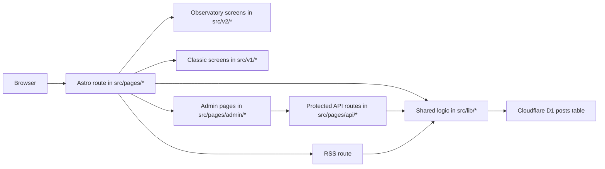

# Deepanker Personal Website Architecture Source of Truth

Last updated: 2026-03-30

This document is the implementation-accurate source of truth for how the current repository works.

If this document conflicts with older planning docs, V2 rollout notes, or stale README text from earlier revisions, trust this document and the current code.

## 1. Fastest Possible Mental Model

- This project is one Astro server-rendered application.
- It is built for Cloudflare Workers and uses Cloudflare D1 as its only real content store.
- The only editorial source of truth is the D1 `posts` table.
- The root public experience is `Observatory` and lives in `src/v2/*`.
- The alternate public experience is `Classic` and lives in `src/v1/*` under `/classic`.
- The admin CMS lives at `/admin/*`.
- The API surface lives at `/api/auth/*` and `/api/posts/*`.
- Markdown is rendered at write time, stored in D1 as `rendered_html`, and injected into pages at read time.
- Public pages read from D1 directly during SSR. They do not call internal APIs to assemble the page.
- Inline JavaScript is used only for small client enhancements such as search, theme toggles, reading controls, and admin form actions.
- Astro content collections are not used for real content anymore.

If you remember only one thing, remember this:

> One database, one admin flow, two public skins.

## 2. Evidence Policy

This document uses three labels:

- `Confirmed`
  - directly visible in the current codebase, schema, config, or executable scripts
- `Reasonable inference`
  - strongly implied by the implementation, but not explicitly stated in one place
- `Historical/stale`
  - visible in older docs or plans, but contradicted by the current code

## 3. Current Route Truth

### 3.1 Public routes

| Route | Purpose | Actual implementation |
| --- | --- | --- |
| `/` | Observatory home | `src/pages/index.astro` -> `src/v2/screens/HomeScreen.astro` |
| `/writing` | Observatory library | `src/pages/writing/index.astro` -> `src/v2/screens/WritingIndexScreen.astro` |
| `/writing/:slug` | Observatory essay | `src/pages/writing/[slug].astro` -> `src/v2/screens/EssayScreen.astro` |
| `/classic` | Classic home | `src/pages/classic/index.astro` -> `src/v1/screens/HomeScreen.astro` |
| `/classic/writing` | Classic writing index | `src/pages/classic/writing/index.astro` -> `src/v1/screens/WritingIndexScreen.astro` |
| `/classic/writing/:slug` | Classic essay | `src/pages/classic/writing/[slug].astro` -> `src/v1/screens/WritingPostScreen.astro` |
| `/rss.xml` | RSS feed | `src/pages/rss.xml.js` |

### 3.2 Admin routes

| Route | Purpose |
| --- | --- |
| `/admin/login` | Password sign-in |
| `/admin` | Post dashboard |
| `/admin/posts/new` | New post editor |
| `/admin/posts/:id/edit` | Edit post editor |
| `/admin/posts/:id/preview` | Full preview page |

### 3.3 API routes

| Route | Methods | Purpose |
| --- | --- | --- |
| `/api/auth/login` | `POST` | Verify password and set auth cookie |
| `/api/auth/logout` | `POST` | Clear auth cookie |
| `/api/posts` | `GET`, `POST` | List all posts or create a post |
| `/api/posts/:id` | `GET`, `PUT`, `DELETE` | Read, update, or delete a post |

### 3.4 Shared route helper truth

Confirmed:

- `src/shared/public/routes.ts` is the shared route helper used across the app.
- `publicUrl("v2", ...)` maps to the root routes.
- `publicUrl("v1", ...)` maps to `/classic`.

That means:

- `publicUrl("v2", "home")` -> `/`
- `publicUrl("v2", "writing")` -> `/writing`
- `publicUrl("v1", "home")` -> `/classic`
- `publicUrl("v1", "writing")` -> `/classic/writing`

Historical/stale:

- Older docs described V1 at `/` and V2 at `/v2`.
- That is no longer true in the current code.

## 4. What This App Is

Confirmed:

- a personal writing platform for essays and long-form pieces
- a single deployable Astro SSR app
- a built-in admin CMS for one operator
- two public reading experiences over the same content store
- an RSS-producing site

Reasonable inference:

- this is currently intended for a single author/operator
- the auth model is a single password and single admin token, not a multi-user account system

### What it is not

Confirmed:

- not a static Markdown/MDX blog driven by files in the repo
- not an Astro content-collections site
- not a React or SPA frontend talking to a separate backend
- not a multi-service architecture with separate API and web deploys
- not a dual-database or dual-CMS system
- not a `/v2` preview site anymore

## 5. High-Level Architecture

At runtime, the app is one server-rendered Astro application hosted on Cloudflare Workers.

The practical layering is:

1. D1 schema and rows
2. shared server helpers
3. Astro route wrappers
4. version-specific presentation
5. inline client enhancement scripts

## 6. Runtime Surfaces

## 6.1 Observatory public experience

Confirmed:

- The Observatory experience is the root public experience.
- Its route wrappers are:
  - `src/pages/index.astro`
  - `src/pages/writing/index.astro`
  - `src/pages/writing/[slug].astro`
- Its presentation layer lives in `src/v2/*`.

### Observatory home

Confirmed:

- Home fetches all published posts through `getAllPublishedPosts(db)`.
- The first published post in descending `published_at` order becomes the lead artifact.
- The next 5 posts become the secondary shelf.
- The `featured` flag is ignored on this page.

That means the Observatory home is latest-first, not featured-first.

### Observatory library

Confirmed:

- Library fetches all published posts server-side.
- The page renders all cards up front.
- Search is entirely client-side.
- Search matches case-insensitive substrings against:
  - title
  - description
  - joined tags text
- Search state is mirrored into the URL query string as `?q=...`.
- Browser history state is kept in sync through `history.replaceState` and `popstate`.

Confirmed current non-features:

- no tag filter UI
- no sort UI
- no server-side search endpoint

Historical/stale:

- older docs mentioned richer composable discovery and multiple controls
- the current implementation only exposes a search input

### Observatory essay page

Confirmed:

- Essay routes fetch one published post by slug.
- The page renders:
  - a masthead with procedural cover art
  - published date and reading time
  - optional updated date
  - tag pills
  - the stored `rendered_html`
  - reading controls
- On desktop, reading controls live in a sticky sidebar.
- On narrower widths, they move into the main content column.

Confirmed client-side reading behavior:

- progress is derived from scroll position against the prose container
- tone is persisted in `localStorage` as `v2-reading-tone`
- type scale is persisted in `localStorage` as `v2-reading-scale`
- progress text is mirrored into accessible progressbar attributes and a polite live region

## 6.2 Classic public experience

Confirmed:

- The Classic experience lives under `/classic`.
- Its route wrappers are:
  - `src/pages/classic/index.astro`
  - `src/pages/classic/writing/index.astro`
  - `src/pages/classic/writing/[slug].astro`
- Its presentation layer lives in `src/v1/*`.

### Classic home

Confirmed:

- Home fetches featured published posts through `getFeaturedPosts(db)`.
- It separately fetches all published posts through `getAllPublishedPosts(db)`.
- It renders:
  - a Featured section from the `featured = 1` query
  - a Latest section from the latest published posts

Confirmed nuance:

- the page does not deduplicate between Featured and Latest
- a featured post can therefore appear in both sections

### Classic writing index

Confirmed:

- The page fetches all published posts and unique tags server-side.
- Search is client-side and matches title plus description only.
- Tag filtering is client-side and matches the parsed JSON tags array on each card.
- Search state is not URL-synced.
- Tag state is not URL-synced.

### Classic essay page

Confirmed:

- The page fetches one published post by slug.
- It uses the same stored `rendered_html` as Observatory.
- It renders that HTML in a simpler article layout with date, reading time, tags, and optional last-updated text.

## 6.3 Admin CMS

Confirmed:

- Admin routes are server-rendered Astro pages.
- Admin reads go straight to D1 through shared DB helpers.
- Admin writes happen through `fetch()` calls to the protected JSON API.

### Admin login

Confirmed:

- `/admin/login` is public and bypasses middleware auth checks.
- The page posts `{ password }` JSON to `/api/auth/login`.
- On success it redirects to `/admin`.

### Admin dashboard

Confirmed:

- `/admin` fetches all posts, not just published ones.
- It shows title, status, updated date, and actions.
- Delete is handled by a client-side `fetch()` to `DELETE /api/posts/:id`.

### New and edit flows

Confirmed:

- New and edit pages are plain Astro pages with inline browser scripts.
- The forms send JSON to:
  - `POST /api/posts`
  - `PUT /api/posts/:id`
- The editor exposes:
  - title
  - slug
  - tags
  - description
  - markdown content
  - featured checkbox
  - cover variant
  - cover accent

### Preview behavior

This is an important implementation detail.

Confirmed:

- `/admin/posts/:id/preview` is the only true full preview route.
- It fetches the stored post row server-side.
- It renders `post.rendered_html`.

Confirmed caveat:

- it renders through the legacy top-level `src/layouts/PostLayout.astro`
- that means it is not the same shell as Classic or Observatory

Confirmed inline preview quirks:

- The new-post editor's Preview tab sends a real `POST` to `/api/posts` with a `"preview"` title and `draft` status, then falls back to a regex-based client preview.
- The edit page's Preview tab is regex-based only and does not use `marked` or the stored HTML.

Practical consequence:

- inline preview can diverge from actual public rendering
- new-post inline preview is not a harmless ephemeral render step

## 6.4 JSON APIs

Confirmed:

- The public site does not depend on these APIs for initial page rendering.
- These APIs exist primarily for admin auth and admin mutations.

### `/api/auth/login`

Confirmed:

- method: `POST`
- input: JSON `{ password }`
- reads:
  - `ADMIN_PASSWORD_HASH`
  - `JWT_SECRET`
- output:
  - `200` with `{ success: true }` and `Set-Cookie`
  - `400` if password missing
  - `401` if password invalid
  - `500` if server secrets are missing

### `/api/auth/logout`

Confirmed:

- method: `POST`
- clears the auth cookie
- returns `{ success: true }`

### `/api/posts`

Confirmed:

- protected by middleware
- `GET` returns all posts
- `POST`:
  - requires `title` and `content`
  - auto-generates slug if absent
  - renders markdown to HTML
  - normalizes tags from string or array
  - normalizes cover metadata
  - returns the created row

### `/api/posts/:id`

Confirmed:

- protected by middleware
- `GET` returns one post by id
- `PUT` updates the row and re-renders markdown when `content` changes
- `DELETE` deletes the row

## 6.5 RSS

Confirmed:

- RSS is generated at `/rss.xml`.
- It uses `getAllPublishedPosts(db)`.
- Feed items include:
  - `title`
  - `description`
  - `pubDate`
  - `link`

Confirmed SEO detail:

- RSS links point to `/writing/:slug/`
- that means RSS treats root Observatory essay routes as canonical

## 7. Shared Server and Data Layer

## 7.1 Environment and bindings

Confirmed:

- `src/env.d.ts` declares:
  - `DB: D1Database`
  - `ADMIN_PASSWORD_HASH: string`
  - `JWT_SECRET: string`
- Astro accesses these through `Astro.locals.runtime.env`.

Confirmed current absence:

- no app-specific KV binding in the typed env
- no R2 binding
- no external auth provider binding

Reasonable inference:

- the Cloudflare adapter may print session-related advisory output in dev, but the app code itself does not use Astro Sessions

## 7.2 Database helper layer (`src/lib/db.ts`)

Confirmed:

- There is no ORM.
- All data access is direct D1 prepared SQL.

### `Post` contract

Confirmed fields:

- `id`
- `slug`
- `title`
- `description`
- `content`
- `rendered_html`
- `tags`
- `status`
- `featured`
- `cover_variant`
- `cover_accent`
- `created_at`
- `updated_at`
- `published_at`

### Public query helpers

Confirmed:

- `getAllPublishedPosts(db)`
  - `SELECT * FROM posts WHERE status = 'published' ORDER BY published_at DESC`
- `getFeaturedPosts(db)`
  - published only
  - `featured = 1`
  - latest 5
- `getPostBySlug(db, slug)`
  - published only
- `getUniqueTags(db)`
  - derives tags in application code from all published posts

### Admin query helpers

Confirmed:

- `getAllPosts(db)`
  - returns every row ordered by `updated_at DESC`
- `getPostById(db, id)`
  - returns any row by id regardless of status

### Mutation helpers

Confirmed:

- `createPost(db, input)`
  - generates `id` with `crypto.randomUUID()`
  - sets `now` with `new Date().toISOString()`
  - sets `published_at` when the initial status is `published`
  - stores tags as `JSON.stringify(input.tags)`
- `updatePost(db, id, input)`
  - reads existing row first
  - applies partial updates
  - reuses old values when fields are omitted
  - preserves existing `published_at`
  - sets `published_at` only when transitioning into published with no prior publish date
- `deletePost(db, id)`
  - hard deletes the row

Confirmed nuance:

- unpublishing does not clear `published_at`
- republishing later therefore retains the first publish timestamp

## 7.3 Markdown layer (`src/lib/markdown.ts`)

Confirmed:

- Markdown is rendered with `marked`.
- Code blocks are highlighted with `highlight.js`.
- Unknown languages fall back to `plaintext`.
- `renderMarkdown()` returns a string immediately; async markdown extensions are not used.
- Reading time uses a fixed `200` words-per-minute estimate.
- Slugs are generated from title text by:
  - lowercasing
  - removing non-alphanumeric characters except spaces and hyphens
  - collapsing whitespace to hyphens
  - trimming hyphens
  - truncating to 80 characters

This means the authoritative publishing path is:

- raw markdown in
- HTML string persisted to D1
- stored HTML injected at render time

The app does not re-render markdown for public page requests.

## 7.4 Auth layer (`src/lib/auth.ts`)

Confirmed:

- Passwords are verified by comparing a SHA-256 hash of the submitted password against `ADMIN_PASSWORD_HASH`.
- Token format is a custom HMAC-SHA256 JWT-like token.
- Tokens are valid for 7 days.
- The token payload contains:
  - `sub: "admin"`
  - `iat`
  - `exp`

### Cookie behavior

Confirmed:

- cookie name: `admin_token`
- attributes:
  - `Path=/`
  - `HttpOnly`
  - `SameSite=Strict`
  - `Max-Age=604800`

Confirmed caveat:

- the code does not currently add the `Secure` cookie attribute

## 7.5 Middleware (`src/middleware.ts`)

Confirmed:

- `/admin/login` is public
- `/api/auth/*` is public
- `/admin/*` is protected
- `/api/posts/*` is protected
- invalid admin access redirects to `/admin/login`
- invalid API access returns `401 {"error":"Unauthorized"}`

This is the entire route-protection model.

## 8. Database and Storage Model

## 8.1 D1 is the only real content store

Confirmed:

- all real post content is in D1
- there is no file-based content pipeline in `src/content.config.ts`
- there is no external CMS
- there is no separate object storage integration in the codebase

If a post contains images or other embeds, they would need to be referenced in markdown/HTML content directly. There is no repository-visible upload or asset-management system.

## 8.2 Schema

Confirmed schema fields in `schema.sql`:

| Column | Type/shape | Purpose |
| --- | --- | --- |
| `id` | `TEXT PRIMARY KEY` | UUID post id |
| `slug` | `TEXT UNIQUE NOT NULL` | URL slug |
| `title` | `TEXT NOT NULL` | post title |
| `description` | `TEXT DEFAULT ''` | excerpt / meta description |
| `content` | `TEXT NOT NULL` | raw markdown |
| `rendered_html` | `TEXT NOT NULL` | stored rendered HTML |
| `tags` | `TEXT DEFAULT '[]'` | JSON array string |
| `status` | `draft` or `published` | publication status |
| `featured` | `INTEGER DEFAULT 0` | classic-home featured flag |
| `cover_variant` | `TEXT` nullable | Observatory cover override |
| `cover_accent` | `TEXT` nullable | Observatory cover override |
| `created_at` | `TEXT` | creation timestamp |
| `updated_at` | `TEXT` | last edit timestamp |
| `published_at` | `TEXT` nullable | first publish timestamp |

### Important model semantics

Confirmed:

- `featured` only matters to the Classic home page
- `cover_variant` and `cover_accent` only matter to the Observatory cover system
- `tags` are denormalized into one JSON string column, not a join table

## 8.3 Migrations

Confirmed:

- `migrations/0002_add_cover_metadata_columns.sql` is additive
- it adds:
  - `cover_variant`
  - `cover_accent`

This exists to patch older D1 databases that predate Observatory cover metadata.

## 8.4 Seed data

Confirmed:

- `seed.sql` inserts:
  - 2 published sample posts
  - 1 draft sample post

That seed data supports local smoke tests and gives the app enough content to render both public surfaces.

## 9. Shared Public Contracts

## 9.1 Route contract

Confirmed:

- `src/shared/public/routes.ts` is the single shared public route helper
- it is the canonical place to derive cross-surface public URLs

Future agents should prefer using `publicUrl()` rather than hardcoding public paths.

## 9.2 Cover metadata contract

Confirmed:

- allowed `cover_variant` values:
  - `topographic`
  - `horizon`
  - `mineral`
  - `weather`
  - `signal`
  - `field-note`
- allowed `cover_accent` values:
  - `moss`
  - `river`
  - `brass`
  - `dawn`

Confirmed:

- invalid or blank values are normalized to `null`
- normalization happens before persistence in the post APIs

## 9.3 Observatory cover engine

Confirmed:

- `src/v2/features/covers/cover.ts` derives a deterministic cover model from:
  - `slug`
  - `title`
  - `tags`
  - optional explicit overrides
- fallback cover choices are deterministic, not random per request
- `src/v2/features/covers/V2Cover.astro` renders the cover as CSS and SVG-based procedural artwork

Supported modes:

- `feature`
- `card`
- `masthead`
- `stamp`

Important boundary:

- this entire system is Observatory-only
- Classic does not render cover art

## 10. Frontend Architecture

## 10.1 Rendering model

Confirmed:

- Astro file-based routing is the only routing system
- pages are server-rendered HTML
- there is no React, Vue, or client SPA framework
- client interactivity is implemented with inline `<script>` blocks in Astro components/pages

This is a progressive-enhancement site, not a client-heavy app.

## 10.2 State management model

Confirmed:

- there is no centralized client state library
- state is handled through:
  - DOM state
  - `data-*` attributes
  - `localStorage`
  - `URLSearchParams`
  - `history.replaceState`

### Client-side state by feature

| Feature | Storage / communication model |
| --- | --- |
| Theme | `localStorage("theme")` plus `html[data-theme]` |
| Observatory library search | input value plus `?q=` in URL |
| Classic search | input value only |
| Classic tag filter | `aria-pressed` and card display state |
| Reading tone | `localStorage("v2-reading-tone")` |
| Reading type scale | `localStorage("v2-reading-scale")` |
| Reading progress | derived from scroll position and prose geometry |

## 10.3 Styling systems

Confirmed:

- Observatory has its own style system:
  - `src/v2/styles/tokens.css`
  - `src/v2/styles/global.css`
  - `src/v2/styles/motion.css`
- Classic has its own extracted stylesheet:
  - `src/v1/styles/global.css`
- The legacy top-level stylesheet remains runtime-relevant for admin and preview:
  - `src/styles/global.css`

### Typography

Confirmed:

- Observatory fonts:
  - Instrument Serif
  - Newsreader
  - Instrument Sans
  - IBM Plex Mono
- Classic fonts:
  - Inter
  - Source Serif 4

### External runtime asset dependency

Confirmed:

- both style systems import Google Fonts directly through CSS `@import`

## 10.4 SEO and metadata behavior

Confirmed:

- Observatory root pages canonicalize to themselves.
- Classic pages set canonical URLs to the matching root Observatory routes.
- RSS points to root Observatory essay links.
- Admin pages are explicitly `noindex, nofollow`.

Confirmed nuance:

- Observatory's `BaseHead` supports a `noindex` prop
- current public Observatory screens do not pass `noindex`
- therefore Observatory is not acting as a noindexed preview layer anymore

Historical/stale:

- older docs described Observatory/V2 as a noindexed preview under `/v2`
- that is no longer true

## 10.5 Hard-coded vs CMS-driven content

Confirmed:

- posts come from D1
- much of the surrounding site copy is hard-coded in components/screens

Examples of hard-coded content:

- Observatory hero copy
- Classic hero copy
- Observatory footer contact links
- site title/description constants in `src/consts.ts`

Reasonable inference:

- the CMS is intentionally narrow and only manages posts, not the entire marketing or site chrome layer

## 10.6 Legacy top-level layer still matters

Confirmed:

- `src/components/*`
- `src/layouts/*`
- `src/styles/global.css`

are no longer the main public layer, but they are still active in runtime-critical places.

Confirmed current usage:

- `src/pages/admin/login.astro` uses top-level `BaseHead`
- `src/layouts/AdminLayout.astro` uses top-level `BaseHead`
- `src/pages/admin/posts/[id]/preview.astro` uses top-level `PostLayout`

This means future agents should not assume those files are dead.

## 11. End-to-End Flows

## 11.1 Public page read flow

1. Browser requests a public route.
2. Astro route reads `DB` from `Astro.locals.runtime.env`.
3. Route calls a shared DB helper.
4. Route passes the row(s) to a V1 or V2 screen.
5. Screen renders HTML.
6. Optional inline scripts bind after load.

There is no internal API hop in this flow.

## 11.2 Admin login flow

1. Browser loads `/admin/login`.
2. User submits password.
3. Page posts JSON to `/api/auth/login`.
4. API hashes input and compares against `ADMIN_PASSWORD_HASH`.
5. API creates an HMAC-signed token using `JWT_SECRET`.
6. API sets the `admin_token` cookie.
7. User is redirected to `/admin`.
8. Middleware allows future `/admin/*` and `/api/posts/*` access while the token is valid.

## 11.3 Create / update / publish flow

1. Admin editor submits JSON to `/api/posts` or `/api/posts/:id`.
2. API validates required fields.
3. API generates or accepts slug.
4. API renders markdown to `rendered_html`.
5. API normalizes tags and optional cover metadata.
6. API writes the row to D1.
7. If `status = "published"`, the row becomes visible on:
   - Observatory
   - Classic
   - RSS

## 11.4 Unpublish flow

1. Editor sends `status: "draft"` to `PUT /api/posts/:id`.
2. Row remains in D1.
3. Public queries stop returning it.
4. `published_at` is preserved rather than cleared.

## 11.5 Preview flows

### Full preview route

1. Browser requests `/admin/posts/:id/preview`.
2. Route fetches full row by id.
3. Page renders `post.rendered_html`.
4. Legacy preview shell is shown with a preview banner.

### New-post inline preview

1. User clicks the Preview tab on the new-post editor.
2. The page sends `POST /api/posts` with a draft `"preview"` payload.
3. The page then renders a fallback regex-based HTML preview in the browser.

This is a real write operation, not just a client-only preview operation.

### Edit inline preview

1. User clicks the Preview tab on the edit screen.
2. The page runs a regex-based transformation on the textarea contents.
3. It does not use the markdown renderer or stored HTML.

## 11.6 RSS flow

1. Request hits `/rss.xml`.
2. Route queries all published posts.
3. Astro RSS helper serializes feed items.
4. Feed links point to Observatory essay URLs.

## 12. Project Structure by Responsibility

## 12.1 Root files

- `package.json`
  - dependencies, engine requirement, scripts
- `astro.config.mjs`
  - Astro SSR config, site URL, Cloudflare adapter
- `wrangler.json`
  - Worker entrypoint, D1 binding, assets binding, compat flags
- `schema.sql`
  - canonical D1 schema
- `seed.sql`
  - local sample content
- `migrations/`
  - additive SQL changes for already-created DBs
- `worker-configuration.d.ts`
  - generated Wrangler types

## 12.2 `src/pages`

This is the real request surface of the app.

- root Observatory routes:
  - `src/pages/index.astro`
  - `src/pages/writing/*`
- Classic routes:
  - `src/pages/classic/*`
- admin routes:
  - `src/pages/admin/*`
- APIs:
  - `src/pages/api/*`
- RSS:
  - `src/pages/rss.xml.js`

Important current truth:

- there is no `src/pages/v2/*` route tree in the current repo

## 12.3 `src/lib`

Shared server logic:

- `db.ts`
- `markdown.ts`
- `auth.ts`

This is effectively the backend core of the application.

## 12.4 `src/shared/public`

Cross-presentation public contracts:

- `routes.ts`
- `covers.ts`

This is where shared public rules belong so that `src/v1/*` and `src/v2/*` do not import each other directly.

## 12.5 `src/v1`

Classic public presentation layer:

- `components/`
- `layouts/`
- `screens/`
- `styles/`

## 12.6 `src/v2`

Observatory public presentation layer:

- `components/chrome/`
- `components/PostArtifactCard.astro`
- `features/covers/`
- `features/discovery/`
- `features/reading/`
- `layouts/`
- `screens/`
- `styles/`

## 12.7 Legacy top-level presentation layer

Still used by:

- admin head/layout
- full preview page

These files are not dead and should not be removed casually without tracing current usage.

## 12.8 Docs and scripts

- `README.md`
  - top-level operational and architectural orientation
- `docs/architecture/system-source-of-truth.md`
  - implementation-accurate architecture document
- `scripts/check-version-boundaries.mjs`
  - enforces no direct v1/v2 imports
- `scripts/route-smoke.mjs`
  - route existence/content smoke checks
- `scripts/final-qa-audit.mjs`
  - accessibility-structure and asset-budget checks

## 13. Local Runtime and Deployment

## 13.1 Astro config

Confirmed:

- `site = "https://deepankerseth.com"`
- `output = "server"`
- integrations:
  - `@astrojs/mdx`
  - `@astrojs/sitemap`
- adapter:
  - `@astrojs/cloudflare`
  - `platformProxy.enabled = true`

`@astrojs/mdx` is installed but current content is still D1-backed, not file-backed.

## 13.2 Wrangler config

Confirmed:

- Worker entrypoint:
  - `./dist/_worker.js/index.js`
- static assets directory:
  - `./dist`
- D1 binding:
  - `DB`
- `nodejs_compat` is enabled
- Cloudflare observability is enabled
- source map upload is enabled

## 13.3 Local development flow

Confirmed expected local setup:

1. `npm install`
2. create local D1 tables from `schema.sql`
3. optionally seed from `seed.sql`
4. create `.dev.vars` with:
   - `ADMIN_PASSWORD_HASH`
   - `JWT_SECRET`
5. run `npm run dev`

Confirmed repo note:

- `.gitignore` expects `.env.example` and `.dev.vars.example` patterns
- neither example file is currently checked into the repo

## 13.4 Deployment flow

Confirmed visible path:

1. create the D1 database in Cloudflare
2. apply `schema.sql`
3. apply `migrations/0002_add_cover_metadata_columns.sql` if needed
4. set secrets:
   - `ADMIN_PASSWORD_HASH`
   - `JWT_SECRET`
5. run `npm run build`
6. run `wrangler deploy`

Reasonable inference:

- direct Wrangler deployment is the real operational path today

Historical/stale:

- older README text mentioned GitHub Actions
- no workflow files were present in the inspected repo when this document was updated

## 14. Verification and Guardrails

## 14.1 Import boundary guard

Confirmed:

- `scripts/check-version-boundaries.mjs` walks `src/v1/*` and `src/v2/*`
- it fails if either side imports the other directly
- shared contracts should live outside those version roots

This guard passed during the 2026-03-30 inspection.

## 14.2 Route smoke tests

Confirmed:

- `scripts/route-smoke.mjs` expects the current route truth:
  - `/`
  - `/writing`
  - `/classic`
  - `/classic/writing`
  - one Observatory essay route
  - one Classic essay route

It passed during the 2026-03-30 inspection when allowed to bind a localhost port.

## 14.3 Final QA audit

Confirmed:

- `scripts/final-qa-audit.mjs` checks:
  - built CSS and JS budgets
  - route structure
  - accessibility markers
  - canonical metadata

### Current known mismatch

Confirmed:

- the audit currently expects `id="library-count" aria-live="polite"` on `/writing`
- the current Observatory library implementation does not render `#library-count`
- it renders `#library-empty` instead

Result:

- the asset-budget stage passed
- the route-structure stage failed on the missing `library-count` live region

### Last observed budget stage output on 2026-03-30

- total CSS: `44.1 KiB raw / 11.4 KiB gzip`
- largest CSS asset: `17.7 KiB`
- client JS payload in `dist/_astro`: `0.0 KiB raw`

### Environment note

Confirmed:

- smoke and audit spawn a local Astro server
- if the environment cannot bind localhost ports, they time out before testing routes

## 15. Historical or Stale Assumptions to Ignore

If you see any of the following elsewhere in the repo, treat them as outdated:

- "V1 is at `/`"
- "V2 is at `/v2`"
- "Observatory/V2 is noindexed preview traffic"
- "Classic is the canonical public surface"
- "Public route wrappers live under `src/pages/v2/*`"
- "Search is fuzzy full-text"
- "Observatory library has tag filters and sort controls"
- "Content is driven by Astro content collections or MDX files"

## 16. Key Gotchas for Future Agents

- Use `publicUrl()` instead of hardcoding public route semantics.
- Root routes are Observatory; `/classic` is the alternate public skin.
- Public rendering reads D1 directly; do not assume an internal API round-trip.
- The only real content source is D1. `src/content.config.ts` is a placeholder.
- Stored HTML in `rendered_html` is authoritative for public post rendering.
- Observatory and Classic share the same published rows; they do not have separate content models.
- Observatory home ignores `featured`; Classic home uses it.
- Only Classic has tag filtering.
- New-post inline preview performs a real draft create call.
- Full admin preview uses the legacy top-level layout, not the public Observatory or Classic shells.
- The auth cookie is not marked `Secure` in code.
- The final QA audit currently fails because the implementation and audit expectations disagree on the Observatory library live region.

## 17. Final Mental Model

This project is best understood as:

- one D1-backed editorial system
- one built-in admin workflow
- one SSR Astro app
- two public presentation layers

The shared editorial model lives in D1 and shared server helpers.

The current root public experience is Observatory.

The Classic site is still fully functional, but it is now the alternate presentation under `/classic`.

If you are modifying behavior, ask yourself which layer you are changing:

1. schema / row model
2. shared server logic
3. route wrapper
4. Observatory presentation
5. Classic presentation
6. admin/preview legacy layer

That question is the fastest way to stay oriented in this codebase.
